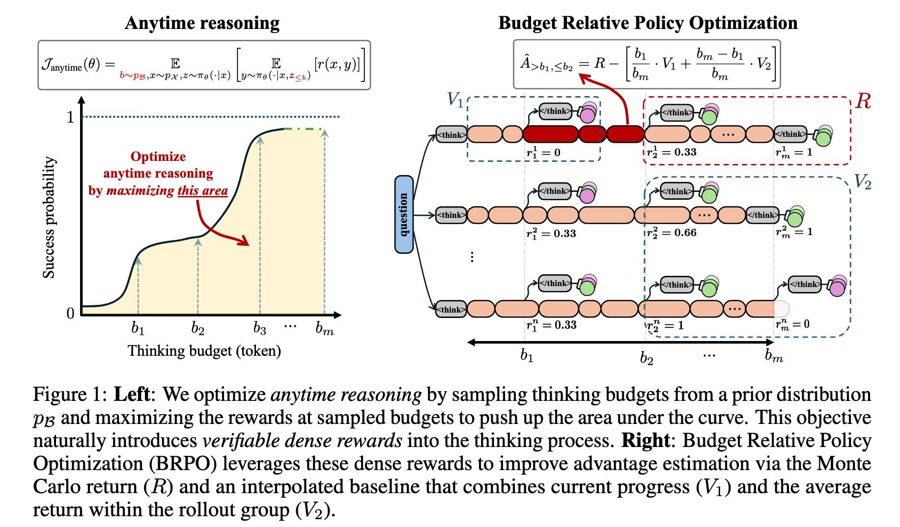
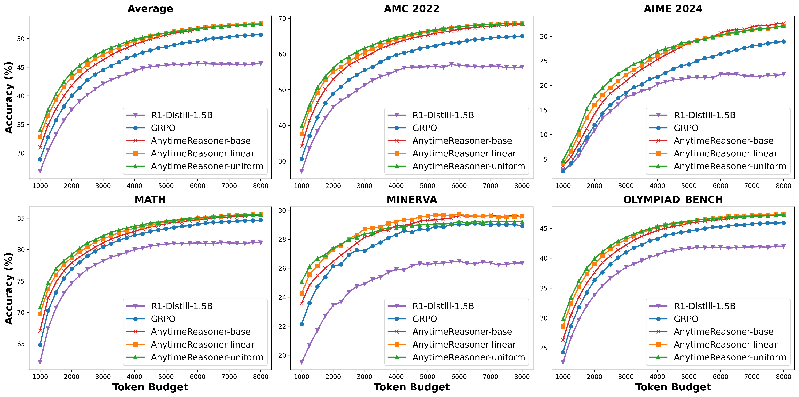
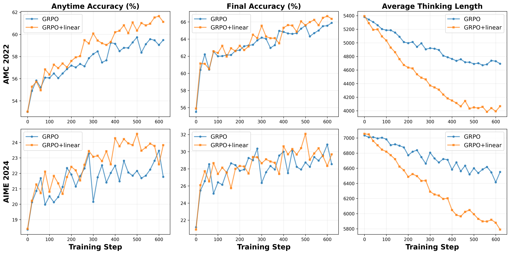
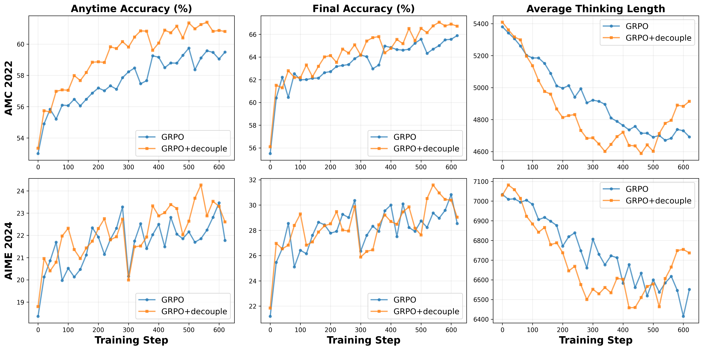
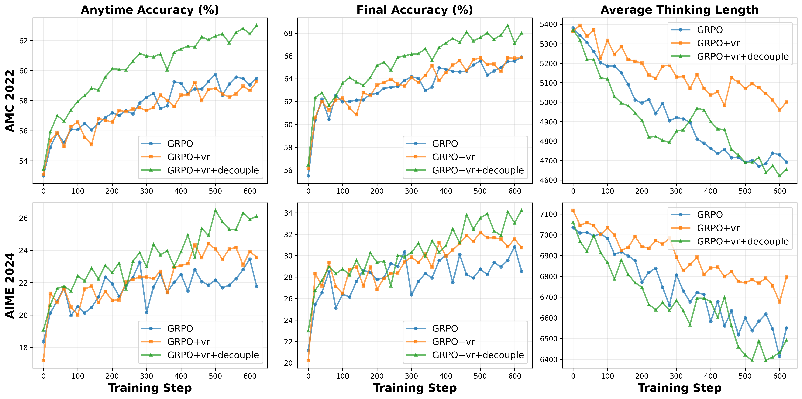

<div align="center">

# Optimizing Anytime Reasoning via Budget Relative Policy Optimization
[Penghui Qi](https://scholar.google.com/citations?user=CLRsGEMAAAAJ&hl=en), [Zichen Liu](https://lkevinzc.github.io/), 
[Tianyu Pang](https://p2333.github.io/), [Chao Du](https://duchao0726.github.io/), [Wee Sun Lee](https://scholar.google.com/citations?user=8PCrLgwAAAAJ&hl=en), [Min Lin](https://scholar.google.com.sg/citations?user=BGONmkIAAAAJ&hl=en)

[](https://arxiv.org/pdf/2505.13438)
[](https://github.com/sail-sg/AnytimeReasoner)

</div>

## Overview





*Figure 1: The comparison of anytime reasoning performance between GRPO and our AnytimeReasoner with various prior budget distributions. Notably, the accuracies at the maximum token budget (8000) reflect the performance in the standard reasoning task.*


<!-- ## Ablations



 -->

## Getting Started 🎯
### Installation
```bash
./setup.sh
```

### Data
To process the data for training and validation, run:
```python
python anytime_reasoner/scripts/data/deepscaler_dataset.py
```

### Training Scripts

```bash
export MODEL_PATH="deepseek-ai/DeepSeek-R1-Distill-Qwen-1.5B"

# GRPO baseline
./anytime_reasoner/scripts/train/run_1.5b_8k.sh --model $MODEL_PATH actor_rollout_ref.rollout.n_summary=1 actor_rollout_ref.rollout.summary_method=grpo actor_rollout_ref.rollout.n_budget_support=1 actor_rollout_ref.rollout.budget_probs=base actor_rollout_ref.rollout.variance_reduction=v2only trainer.experiment_name=GRPO

################################## Main results ##################################
## AnytimeReasoner-linear
./anytime_reasoner/scripts/train/run_1.5b_8k.sh --model $MODEL_PATH actor_rollout_ref.rollout.n_summary=4 actor_rollout_ref.rollout.summary_method=brpo actor_rollout_ref.rollout.n_budget_support=4 actor_rollout_ref.rollout.budget_probs=linear actor_rollout_ref.rollout.variance_reduction=brpo trainer.experiment_name=AR-linear
## AnytimeReasoner-uniform
./anytime_reasoner/scripts/train/run_1.5b_8k.sh --model $MODEL_PATH actor_rollout_ref.rollout.n_summary=4 actor_rollout_ref.rollout.summary_method=brpo actor_rollout_ref.rollout.n_budget_support=4 actor_rollout_ref.rollout.budget_probs=uniform actor_rollout_ref.rollout.variance_reduction=brpo trainer.experiment_name=AR-uniform
## AnytimeReasoner-base
./anytime_reasoner/scripts/train/run_1.5b_8k.sh --model $MODEL_PATH actor_rollout_ref.rollout.n_summary=4 actor_rollout_ref.rollout.summary_method=brpo actor_rollout_ref.rollout.n_budget_support=4 actor_rollout_ref.rollout.budget_probs=base actor_rollout_ref.rollout.variance_reduction=brpo trainer.experiment_name=AR-base

################################## Ablations ##################################
## GRPO+linear
./anytime_reasoner/scripts/train/run_1.5b_8k.sh --model $MODEL_PATH actor_rollout_ref.rollout.n_summary=1 actor_rollout_ref.rollout.summary_method=grpo actor_rollout_ref.rollout.n_budget_support=4 actor_rollout_ref.rollout.budget_probs=linear actor_rollout_ref.rollout.variance_reduction=v2only trainer.experiment_name=GRPO+linear
## GRPO+decouple
./anytime_reasoner/scripts/train/run_1.5b_8k.sh --model $MODEL_PATH actor_rollout_ref.rollout.n_summary=4 actor_rollout_ref.rollout.summary_method=brpo actor_rollout_ref.rollout.n_budget_support=4 actor_rollout_ref.rollout.budget_probs=base actor_rollout_ref.rollout.variance_reduction=v2only trainer.experiment_name=GRPO+decouple
## GRPO+vr
./anytime_reasoner/scripts/train/run_1.5b_8k.sh --model $MODEL_PATH actor_rollout_ref.rollout.n_summary=1 actor_rollout_ref.rollout.summary_method=grpo actor_rollout_ref.rollout.n_budget_support=4 actor_rollout_ref.rollout.budget_probs=base actor_rollout_ref.rollout.variance_reduction=brpo trainer.experiment_name=GRPO+vr
## GRPO+vr+decouple
./anytime_reasoner/scripts/train/run_1.5b_8k.sh --model $MODEL_PATH actor_rollout_ref.rollout.n_summary=4 actor_rollout_ref.rollout.summary_method=brpo actor_rollout_ref.rollout.n_budget_support=4 actor_rollout_ref.rollout.budget_probs=base actor_rollout_ref.rollout.variance_reduction=brpo trainer.experiment_name=GRPO+vr+decouple
```

## Evaluation

Run evaluation:
```bash
./anytime_reasoner/scripts/eval/eval_1.5b_8k.sh --model $MODEL_PATH trainer.resume_mode=$RESUME_PATH
```


## Acknowledgements

- Our training experiments are powered by our heavily modified fork of [Verl](https://github.com/agentica-project/verl), an open-source RLHF library.
- Our model is trained on top of [`DeepSeek-R1-Distill-Qwen-1.5B`](https://huggingface.co/deepseek-ai/DeepSeek-R1-Distill-Qwen-1.5B).
- We use the training/validation data provided by [DeepScaler](https://github.com/agentica-project/rllm).


## Citation
If you find our works useful for your research, please consider citing:

```bibtex
@misc{qi2025optimizinganytimereasoningbudget,
      title={Optimizing Anytime Reasoning via Budget Relative Policy Optimization}, 
      author={Penghui Qi and Zichen Liu and Tianyu Pang and Chao Du and Wee Sun Lee and Min Lin},
      year={2025},
      eprint={2505.13438},
      archivePrefix={arXiv},
      primaryClass={cs.LG},
      url={https://arxiv.org/abs/2505.13438}, 
}
```

